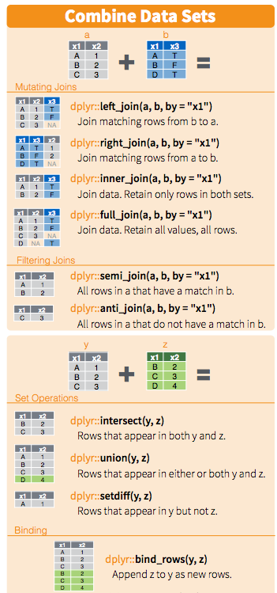

```{r setup, include=FALSE}
knitr::opts_chunk$set(echo = TRUE)
```

This is a cheat sheet to various R packages, R markdown, git and AWS.

Sources:

* http://muuankarski.kapsi.fi/luntti/
* http://adv-r.had.co.nz/
* http://r4ds.had.co.nz/
* https://blog.rstudio.org/
* https://www.rstudio.com/resources/cheatsheets/

#R Packages

##Packages

###Devtools

###Building packages

###Roxygen

##Reading files

##Data manipulation

Tidyverse

###Dplyr & tidyr

```{r}
library(tidyverse)
mtcars %>% 
    select(cyl, vs) 
```

```{r}
mtcars %>% 
    filter(mpg>30)
```

```{r}
glimpse(mtcars)
```

```{r}
library(tidyr)
data <- mtcars %>% 
    add_rownames()
```

```{r}
df <- mtcars %>% 
    select_if(function(col) mean(col)>20)

```

```{r}

df <- df %>% 
    rownames_to_column()  %>% 
    gather("variable", "value", 2:4, -rowname)
```

```{r}
 spread(df, variable,value)
```

```{r}
sample_frac(mtcars, 1/32)
```
```{r}
mtcars %>% 
    sample_n(1)
```

```{r}
mtcars %>% 
    slice(nrow(.)-1)
```

```{r}
mtcars %>% 
    top_n(2, mpg)
```

* select
- helpers
```{r}

select(iris, contains(".")) %>% head
#Select columns whose name contains a character string.
select(iris, ends_with("Length")) %>% head
#Select columns whose name ends with a character string.
select(iris, everything()) %>% head
#Select every column.
select(iris, matches(".t.")) %>% head
#Select columns whose name matches a regular expression.
select(iris, num_range("x", 1:5)) %>% head
#Select columns named x1, x2, x3, x4, x5.
select(iris, one_of(c("Species", "Genus"))) %>% head
#Select columns whose names are in a group of names.
select(iris, starts_with("Sepal")) %>% head
#Select columns whose name starts with a character string.
select(iris, Sepal.Length:Petal.Width) %>% head
#Select all columns between Sepal.Length and Petal.Width (inclusive).
select(iris, -Species) %>% head
#Select all columns except Species. 
```

```{r}
testi <- mtcars %>% 
    group_by(cyl) %>% 
    summarise_all(funs(mean,sum))
```

```{r}
by_species <- iris %>% group_by(Species) %>% mutate_all(funs("in" = . / 2.54))
```

```{r}
arrange(mtcars, cyl) %>% all_equal(mtcars)
```

```{r}
x <- 1:50
case_when(
x %% 35 == 0 ~ "fizz buzz",
x %% 5 == 0 ~ "fizz",
x %% 7 == 0 ~ "buzz",
TRUE ~ as.character(x)
)
```

```{r}
x <- sample(c(1:5, NA, NA, NA))
coalesce(x, 0L)
```
```{r}
y <- c(1, NA, NA, NA, 5)
z <- c(NA, NA, 3, 4, 5)
coalesce(y, z, 0)
```
```{r}
mtcars %>% 
    select(cyl) %>% 
    mutate(testi=cumany(cyl>7)) %>% 
    head()
```



* rename

* complete

```{r}
mtcars %>% 
    group_by(cyl) %>% 
    do(., head(., 2))
```

```{r}
x <- c(5, 1, 3, 2, 2, NA)
row_number(x)
min_rank(x)
dense_rank(x)
percent_rank(x)
cume_dist(x)
ntile(x, 2)
ntile(runif(100), 10)
```

```{r}
x <- sample(c("a", "b", "c"), 10, replace = TRUE)
recode(x, a = "Apple")
recode(x, a = "Apple", .default = NA_character_)

# Named arguments also work with numeric values
x <- c(1:5, NA)
recode(x, `2` = 20L, `4` = 40L)
# Note that if the replacements are not compatible with .x,
# unmatched values are replaced by NA and a warning is issued.
recode(x, `2` = "b", `4` = "d")
# If you don't name the arguments, recode() matches by position
recode(x, "a", "b", "c")
recode(x, "a", "b", "c", .default = "other")
recode(x, "a", "b", "c", .default = "other", .missing = "missing")
# Supply default with levels() for factors
x <- factor(c("a", "b", "c"))
recode(x, a = "Apple", .default = levels(x))
# Use recode_factor() to create factors with levels ordered as they
# appear in the recode call. The levels in .default and .missing
# come last.
x <- c(1:4, NA)
recode_factor(x, `1` = "z", `2` = "y", `3` = "x")
recode_factor(x, `1` = "z", `2` = "y", .default = "D")
recode_factor(x, `1` = "z", `2` = "y", .default = "D", .missing = "M")
# When the input vector is a compatible vector (character vector or
# factor), it is reused as default.
recode_factor(letters[1:3], b = "z", c = "y")
recode_factor(factor(letters[1:3]), b = "z", c = "y")
```


###Strings

####Basic stuff

####Forcats

####Stringr

####Qdap

###Loops

###Dates

####Lubridate

##Graphics

###Ggplot2

###Maps

###Plotly

##Shiny

##Scraping

###Rvest

https://rpubs.com/sneik-/96966

#Regular expressions

#Analytics

##Levenstein distance

##

#Publishing

##Knitr

##R Markdown

###Yaml

#Git

##Git commands

##Github
